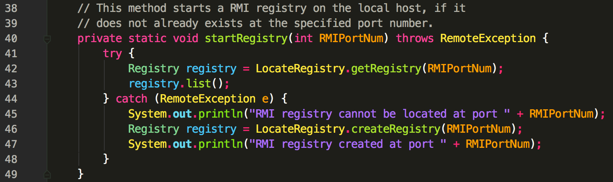
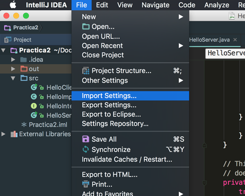

# Rabensome UI Theme for IntelliJ IDEA

__Making your code a color explosion__




> Each element is like a different fruit, with Rabensome everything is clearly defined.

_PetrusBoniatus_

## Installing Rabensome

1. Create a JAR file
```
cd /path/to/Rabensome
jar -cvf rabensome.jar *
```
2. Under _File > Import Settings..._ navigate to the folder in which the JAR was built.

3. Press OK

---
